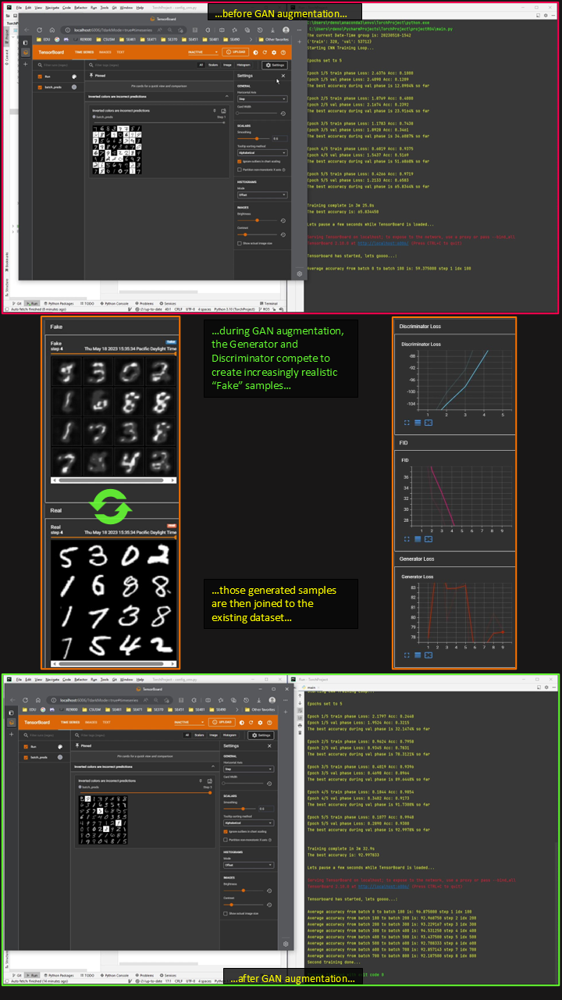

# Machine Learning Operations for Pipeline Automation

## Problem

Machine learning pipelines often require repeated manual steps for data preparation, model training, evaluation, and retraining. This project explored how synthetic data generation could support a more automated image-classification workflow.

## Approach

Built a prototype ML pipeline using a GAN to generate synthetic training samples and a CNN classifier to evaluate model performance. The workflow connected image generation, dataset augmentation, CNN training, TensorBoard monitoring, and performance comparison.

## Results

The prototype demonstrated that GAN-generated samples could be added to the training set and used to improve CNN classification performance. In the demo workflow, increasing the training set from 320 samples to 960 samples improved validation accuracy from approximately 65% to approximately 93%.

## Technologies

Python, PyTorch, TensorBoard, GitLab, PyTest, NumPy, Matplotlib

## Key Topics

Machine Learning, MLOps, GANs, CNNs, Data Augmentation, Computer Vision, Model Evaluation, Pipeline Automation

## Artifacts

* GAN Augmentation Workflow  
* [Project Presentation](presentation/presentation.pdf)
* [Project Report](report/progress-report.pdf)  
* [Source Code](source/)  
* [Demo Video](https://youtu.be/YEcsnmd3NME)  

### GAN Augmentation Workflow 

